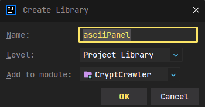

# Cpryt Crawler

# Informações Gerais

## Descrição
> **Este projeto é um jogo estilo Roguelike, onde o personagem está em uma dungeon muito perigosa, e deve explora-lá para**

# Guia game.CryptCrawler

> Use o IntelliJ IDE para jogar
> 
> Para o jogo funcionar corretamente, adicione a biblioteca _asciiPanel.jar_ no repositório

## Adicionando biblioteca _asciiPanel.jar_

### Verificando se tem uma biblioteca desatualizada

1. Verifique se o repositório já está com uma biblioteca (desatualizada) adicionada
2. Para isso vá para o canto superior esquerdo na aba _"File"_ e então para _"Project Structure..."_ ou se preferir aperte as teclas _"Ctrl + Alt + Shift + S"_

    

3. Na nova janela, no canto esquerdo selecione a aba _"Libraries"_
4. Se tiver alguma biblioteca, selecione e aperte no ícone de menos em vermelho para remover, em seguida aperte o botão _"Apply"_

    

### Adicionando biblioteca

1. No canto superior esquerdo do IntelliJ, abra a pasta _"Biblioteca"_, copie o arquivo _asciiPanel.jar_
2. Vá para a pasta _"src"_ e cole o arquivo dentro da pasta _"asciiPanel"_

    

3. Na pasta _"asciiPanel"_, clique com o botão direito do mouse no arquivo e selecione a opção _"Add as Library..."_

    

4. Aperte o botão _"OK"_

    

5. **Biblioteca adicionada!**